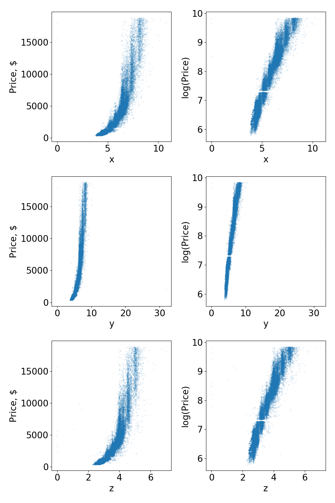
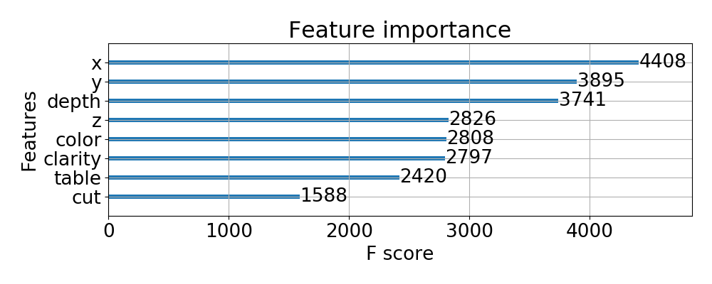

# Diamond Price Prediction

## Table of Contents
1. [Assignment](#assignment)
2. [Data](#data)
3. [Exploratory Data Analysis](#eda)
4. [Model](#Model)

## Assignment 
Engineer at least one feature and build a model that will predict price for each record, given an input file with the same layout as diamonds.txt minus price. The model does not have to use any fancy machine learning. Your feature engineering and model-building may be done in any programming language, although we prefer either Python or R. Please comment the code and make it easily readable.

## Data 
Tab delimited text file with header and 40,000 records of “round” diamonds 
 - **Price**: in US dollars 
 - **Cut**: quality of the cut (Fair, Good, Very Good, Premium, Ideal)
 - **Color**: diamond color, from J (worst) to D (best)
 - **Clarity**: a measurement of how clear the diamond is (I1 (worst), SI2, SI1, VS2, VS1, VVS2, VVS1, IF (best))
 - **Depth**: total depth percentage = z / mean(x, y) = 2 * z / (x + y)
 - **Table**: width of top of diamond relative to widest point
 - **X**: length in mm 
 - **Y**: width in mm 
 - **Z**: depth in mm 

## Exploratory Data Analysis 

Before exploring the data that I was working with, I first first split my data into a training dataset and a holdout test dataset (20% of all rows).

This is the head of the training dataset.

**price**|**cut**|**color**|**clarity**|**depth**|**table**|**x**|**y**|**z**
:-----:|:-----:|:-----:|:-----:|:-----:|:-----:|:-----:|:-----:|:-----:
14307|7954|Premium|D|VS2|60.9|59.0|6.63|6.58
17812|12044|Premium|G|SI1|61.0|59.0|7.38|7.43
11020|5962|Ideal|E|SI2|60.6|56.0|6.76|6.78
15158|8752|Ideal|I|SI1|61.2|58.0|7.35|7.40
24990|462|Good|D|SI2|63.1|54.0|4.33|4.38

Using the `df.describe()` function in pandas, I noticed that a very small percentage of the diamond dimension data appeared to be missing (i.e., a dimension was listed as 0).  In total, 9/3200 (~.3%) diamonds were missing one or more dimensions.  Given the scope of this project, I decided to simply replace missing values with the mean value of that dimension found in either the training set or the test set.  

Some missing values could be calculated using the 'depth' field.  If the model were to be productionalized, I would consider imputing missing data using a k-means clustering approach.

I then did a quick pair plot (in jupyter notebook) to understand the relationships between the variables better. Nothing in this data was too surprising. One thing that is immediately obvious is that there appears to be some collinearity between the variables.  If using an ordinary least squares approach, it would be important to try and reduce this.  For instance, the x, y, and z dimensions might be combined into a single variable for the bounding volume of the diamond. 

One thing I noticed is that the relationship between price and size of a diamond appeared to be exponential. Because of this, I decided to use the logarithmic scale for my predictions. As you can see in the plots below, this effectively linearized the relationship between price and each of the dimensions. 

Before passing data to my model, I also transformed the categorical data into numerical integers corresponding to the scale each category referenced. The final dataframe I used for training and predicting looked like the following:

**cut**|**color**|**clarity**|**depth**|**table**|**x**|**y**|**z**
:-----:|:-----:|:-----:|:-----:|:-----:|:-----:|:-----:|:-----:
3|6|3|60.9|59.0|6.63|6.58|4.02
3|3|2|61.0|59.0|7.38|7.43|4.52
4|5|1|60.6|56.0|6.76|6.78|4.10
4|1|2|61.2|58.0|7.35|7.40|4.51
1|6|1|63.1|54.0|4.33|4.38|2.75

### Considerations on Feature Engineering
As discussed above, I linearized the relationship between the sale price and diamond size (x, y, and z dimensions) by predicting based on the natural log of the price. Doing this transformation resulted in a minor reduction of the mean absolute error (MEA), which I used as my evaluation metric.

I also played around with generating a few additional features, but I was unable to improve my model performance by using any of these metrics.  Here are a few things that I tried using.
 - **Bounding Volume**: x * y * z - approximating the carat size 
 - **Surface Area** x * y - How big the diamond appears when viewed head on
 - **CCC** (cut * clarity * color)^2 - Looking at the compounding nature of these three features
 - **Removing x, y, z** - removing these features when this information is replicated elsewhere (e.g. in volume)
 
If I were to model using ordinary least squares, my hunch is that feature engineering would be much more impactful by both improving the overall accuracy and improving the interpretability of the coefficients.
 

## Model 

I ended up testing both a Random Forest Regressor and Boosting Regressor.  By playing around with the hypter paramters of the Boosting regressor I was able to achieve slightly better results.  Unless specified, the code defaults to using a `XGBRegressor` model.

For my evaluation metric, I've decided to focus on reducing the Mean Absolute Error (MAE).  The RMSE would increase the penalty for predictions that differ significantly from the true value. The MAE would be beneficial to know if, e.g., you were in the business of buying and reselling diamonds.  If you wanted to have a longterm strategy for making money doing this, it might be a good idea only to buy diamonds that are at least the MAE below the predicted price that the diamond would sell in your marketplace for.

### Results
Running the model produces the following evaluation metrics:

`Mean Absolute Error: $271.0`

`R^2:  0.980`

The R^2 value explains the goodness of fit of the model and how much of the variation is explained by the model.  For a quick first try, this model seems to be working quite well!

I've plotted the residuals for my 20% holdout test set below. As you can see, the residuals are centered and evenly distributed around 0.  As shown in the second plot, the residuals further appear to be proportional to the true sale price of the diamond, which is what we would expect.

When using decision trees, you calculate `feature importances` which are indicative of how useful or valuable each feature was in the construction of the boosted decision trees within the model. The more an attribute is used to make important decisions with decision trees, the higher its relative importance. The importance is calculated for a single decision tree by the amount that each attribute split point improves the performance measure, weighted by the number of observations the node is responsible for. The feature importances are then averaged across all of the decision trees within the model to calculate the final values.

### Using the Model
Modes:
1. **Train and Test**:
    Use one dataset for training and testing. Testing will be a 20% hold out test set. If no input filepath is given, it will train/test on the provided diamonds.txt dataset.
    
    Example: `'python diamonds.py train_test'`
    
2. **Train** Train a specific dataset. If no datatset is provided, it will default to training on the `diamonds.txt` dataset.

    Example: `'python diamonds.py train -i data_for_training.txt'`

3. **Predict** Predict on a specific dataset. Run the training option on the diamonds.txt file before predicting on a new dataset

    Example: `'python diamonds.py predict -i data_for_predicting.txt'`

